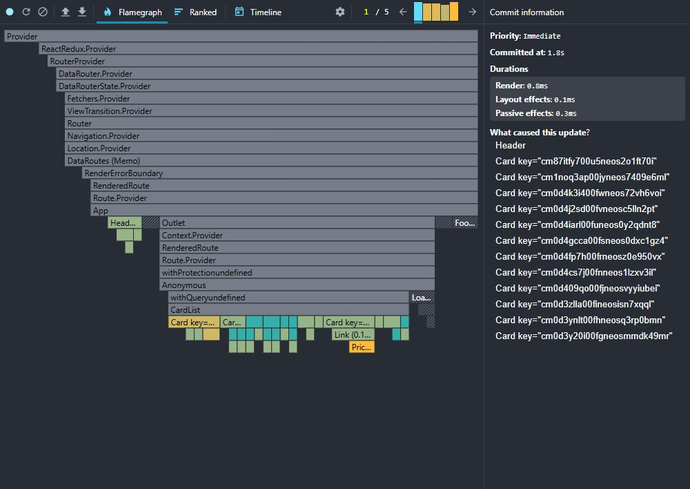
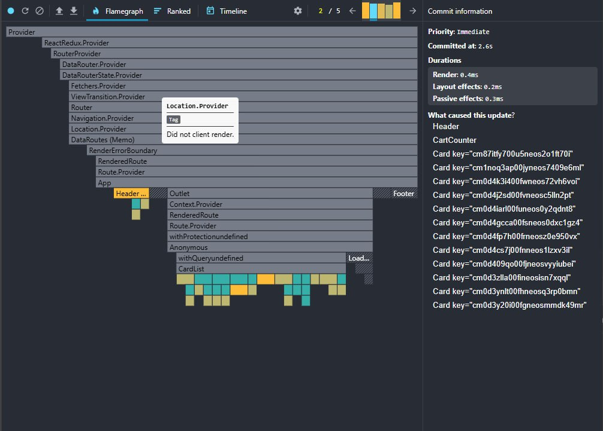
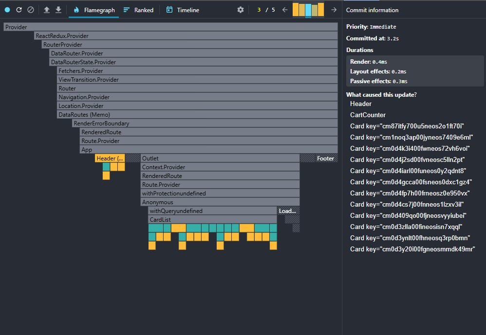
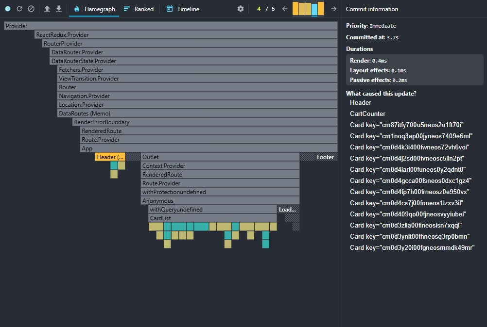
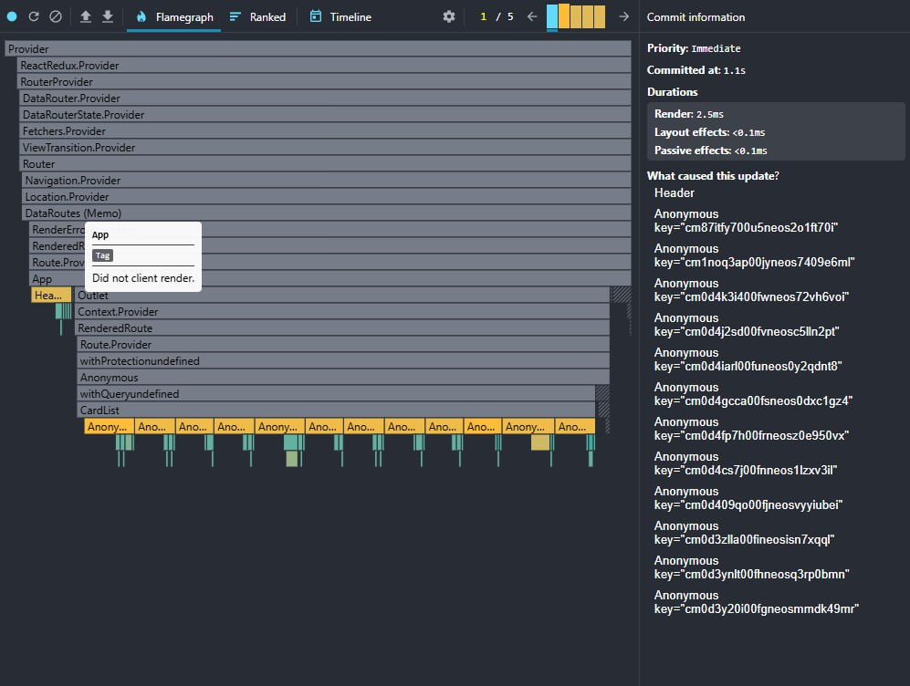
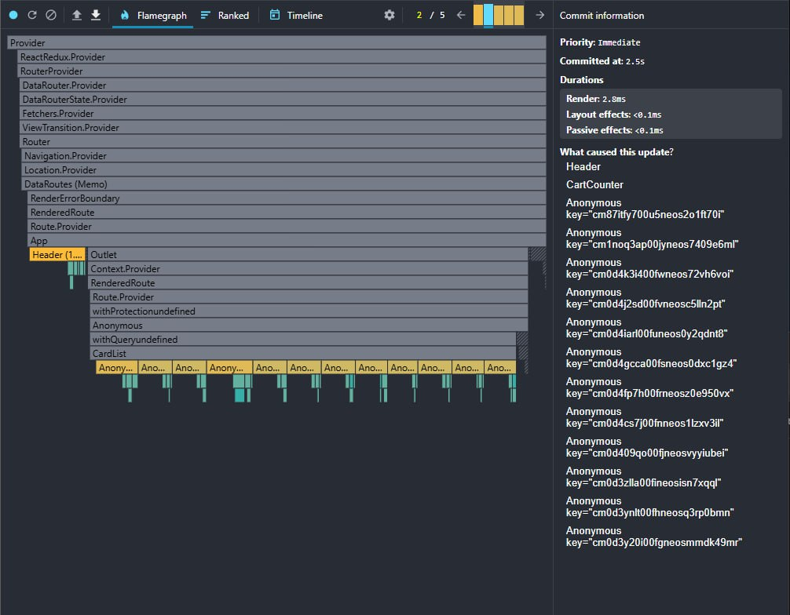
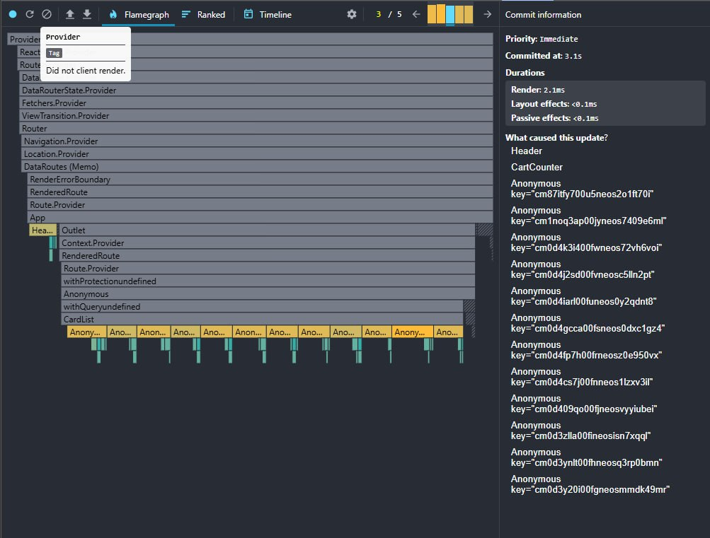
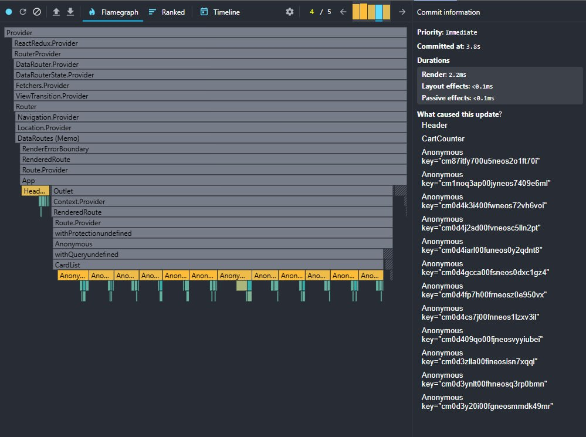

## Презентация
- https://1drv.ms/p/c/8b6765ae77e5842f/IQDoBHUIu69lQpOxNH2hDpFeAcFHDtwHq2k0xMzOwBwiDy4?e=5IoMo1

## Что сделано

- React 19: `react`/`react-dom`/типы обновлены, `useActionState` в форме отзывов (pending/reset/валидация), `useOptimistic` для лайков и списка отзывов.
- Архитектура по слоям `shared/`, `features/`, `pages/`; в `shared/ui` только презентационные компоненты (Button, Input, Loader, Modal, Rating, Logo).
- Портальная модалка (`#modal-root`) с ESC/overlay/крестиком и возвратом фокуса на триггер.
- Оптимизации рендеров: Profiler hotspot на `Card` → `React.memo` + `useMemo/useCallback`; debounce поиска, useRef-наблюдатель в infinite scroll.
- useRef: автофокус на логине, анти-спам таймер в форме отзывов без ререндеров, возврат фокуса в модалке.
- Альтернативная сборка на esbuild + сравнение с webpack.

## Структура папок

```
react-final
|-- .env
|-- .eslintignore
|-- .eslintrc.js
|-- .gitignore
|-- .husky
|   \-- _
|       |-- .gitignore
|       \-- husky.sh
|-- .prettierignore
|-- .prettierrc.js
|-- .stylelintignore
|-- .stylelintrc.json
|-- docs
|   |-- 1.png
|   |-- 2.png
|   |-- 3.png
|   |-- 4.png
|   |-- 5.png
|   |-- 6.png
|   \-- modal.png
|-- esbuild.config.js
|-- package-lock.json
|-- package.json
|-- postcss.config.js
|-- public
|   \-- index.html
|-- README.md
|-- src
|   |-- app
|   |   |-- app.module.css
|   |   |-- App.tsx
|   |   |-- index.ts
|   |   \-- styles
|   |       |-- normalize.css
|   |       \-- styles.css
|   |-- custom.d.ts
|   |-- features
|   |   |-- cart
|   |   |   |-- CartCounter
|   |   |   |   |-- hooks
|   |   |   |   |   \-- useCount.ts
|   |   |   |   |-- index.ts
|   |   |   |   \-- ui
|   |   |   |       |-- CartCounter.module.css
|   |   |   |       \-- CartCounter.tsx
|   |   |   |-- hooks
|   |   |   |   \-- useAddToCart.ts
|   |   |   \-- ProductCartCounter
|   |   |       |-- hooks
|   |   |       |   \-- useCount.ts
|   |   |       |-- index.ts
|   |   |       \-- ui
|   |   |           |-- ProductCartCounter.module.css
|   |   |           \-- ProductCartCounter.tsx
|   |   |-- favorites
|   |   |   |-- index.ts
|   |   |   \-- LikeButton
|   |   |       |-- index.ts
|   |   |       \-- ui
|   |   |           |-- LikeButton.module.css
|   |   |           \-- LikeButton.tsx
|   |   |-- navigation
|   |   |   |-- BackButton
|   |   |   |   |-- index.ts
|   |   |   |   \-- ui
|   |   |   |       \-- ButtonBack.tsx
|   |   |   \-- index.ts
|   |   |-- products
|   |   |   |-- card
|   |   |   |   |-- index.ts
|   |   |   |   \-- ui
|   |   |   |       |-- Card.module.css
|   |   |   |       |-- Card.tsx
|   |   |   |       \-- Price
|   |   |   |           \-- ui
|   |   |   |               |-- Price.module.css
|   |   |   |               \-- Price.tsx
|   |   |   |-- hooks
|   |   |   |   \-- useProducts.ts
|   |   |   |-- load-more
|   |   |   |   |-- hooks
|   |   |   |   |   \-- useLoadMore.ts
|   |   |   |   |-- index.ts
|   |   |   |   \-- ui
|   |   |   |       \-- LoadMore.tsx
|   |   |   \-- sort
|   |   |       |-- hooks
|   |   |       |   \-- useSort.ts
|   |   |       |-- index.ts
|   |   |       \-- ui
|   |   |           \-- Sort.tsx
|   |   \-- search
|   |       |-- hooks
|   |       |   \-- usePostsSearchForm.ts
|   |       |-- index.ts
|   |       \-- ui
|   |           |-- Search.module.css
|   |           \-- Search.tsx
|   |-- index.tsx
|   |-- pages
|   |   |-- CartPage
|   |   |   |-- index.ts
|   |   |   \-- ui
|   |   |       |-- CartAmount
|   |   |       |   |-- index.ts
|   |   |       |   \-- ui
|   |   |       |       \-- CartAmount.tsx
|   |   |       |-- CartItem
|   |   |       |   |-- index.ts
|   |   |       |   \-- ui
|   |   |       |       \-- CartItem.tsx
|   |   |       |-- CartList
|   |   |       |   |-- index.ts
|   |   |       |   \-- ui
|   |   |       |       \-- CartList.tsx
|   |   |       |-- CartPage.module.css
|   |   |       \-- CartPage.tsx
|   |   |-- FavoritesPage
|   |   |   |-- index.ts
|   |   |   \-- ui
|   |   |       \-- FavoritesPage.tsx
|   |   |-- HomePage
|   |   |   |-- index.ts
|   |   |   \-- ui
|   |   |       \-- HomePage.tsx
|   |   |-- NotFoundPage
|   |   |   |-- index.ts
|   |   |   \-- ui
|   |   |       |-- NotFoudPage.module.css
|   |   |       \-- NotFoundPage.tsx
|   |   |-- ProductPage
|   |   |   |-- index.ts
|   |   |   \-- ui
|   |   |       |-- ProductPage.module.css
|   |   |       \-- ProductPage.tsx
|   |   |-- ProfilePage
|   |   |   |-- index.ts
|   |   |   \-- ui
|   |   |       |-- ProfilePage.module.css
|   |   |       \-- ProfilePage.tsx
|   |   |-- SignInPage
|   |   |   |-- index.ts
|   |   |   \-- ui
|   |   |       \-- SignInPage.tsx
|   |   \-- SignUpPage
|   |       |-- index.ts
|   |       \-- ui
|   |           \-- SignUpPage.tsx
|   |-- shared
|   |   |-- api
|   |   |   |-- ApiServise.ts
|   |   |   \-- hooks
|   |   |       \-- useActionCreated.ts
|   |   |-- assets
|   |   |   |-- icons
|   |   |   |   |-- back.svg
|   |   |   |   |-- like.svg
|   |   |   |   |-- quality.svg
|   |   |   |   |-- star.svg
|   |   |   |   |-- trash.svg
|   |   |   |   \-- truck.svg
|   |   |   \-- images
|   |   |       |-- instagram.svg
|   |   |       |-- telegram.svg
|   |   |       |-- viber.svg
|   |   |       |-- vk.svg
|   |   |       \-- whatsapp.svg
|   |   |-- hooks
|   |   |   |-- useDebounce.ts
|   |   |   |-- useOptimisticValue.ts
|   |   |   \-- usePagination.ts
|   |   |-- providers
|   |   |   \-- router
|   |   |       |-- config
|   |   |       |   \-- router.tsx
|   |   |       \-- index.ts
|   |   |-- store
|   |   |   |-- api
|   |   |   |   |-- authApi.ts
|   |   |   |   |-- config.ts
|   |   |   |   \-- productsApi.ts
|   |   |   |-- HOCs
|   |   |   |   |-- WithProtection.tsx
|   |   |   |   \-- WithQuery.tsx
|   |   |   |-- reducers
|   |   |   |   \-- rootReducer.ts
|   |   |   |-- slices
|   |   |   |   |-- cart.ts
|   |   |   |   |-- products.ts
|   |   |   |   \-- user.ts
|   |   |   |-- store.ts
|   |   |   |-- types.ts
|   |   |   \-- utils.ts
|   |   |-- types
|   |   |   \-- global.d.ts
|   |   |-- ui
|   |   |   |-- Button
|   |   |   |   |-- index.ts
|   |   |   |   \-- ui
|   |   |   |       |-- Button.module.css
|   |   |   |       \-- Button.tsx
|   |   |   |-- Input
|   |   |   |   |-- index.ts
|   |   |   |   \-- ui
|   |   |   |       \-- Input.tsx
|   |   |   |-- Loader
|   |   |   |   |-- index.ts
|   |   |   |   \-- ui
|   |   |   |       |-- Loader.module.css
|   |   |   |       \-- Loader.tsx
|   |   |   |-- Logo
|   |   |   |   |-- assets
|   |   |   |   |   \-- logo.svg
|   |   |   |   |-- index.ts
|   |   |   |   \-- ui
|   |   |   |       |-- Logo.module.css
|   |   |   |       \-- Logo.tsx
|   |   |   |-- Modal
|   |   |   |   |-- index.ts
|   |   |   |   \-- ui
|   |   |   |       |-- Modal.module.css
|   |   |   |       \-- Modal.tsx
|   |   |   \-- Rating
|   |   |       |-- index.ts
|   |   |       \-- ui
|   |   |           \-- Rating.tsx
|   |   \-- utils
|   |       |-- common.ts
|   |       |-- getMessageFromError.ts
|   |       |-- index.ts
|   |       \-- isLiked.ts
|   \-- widgets
|       |-- CardList
|       |   |-- index.ts
|       |   \-- ui
|       |       |-- CardList.module.css
|       |       \-- CardList.tsx
|       |-- Footer
|       |   |-- index.ts
|       |   \-- ui
|       |       |-- Footer.module.css
|       |       \-- Footer.tsx
|       |-- Header
|       |   |-- index.ts
|       |   \-- ui
|       |       |-- Header.module.css
|       |       \-- Header.tsx
|       |-- ReviewList
|       |   |-- index.ts
|       |   \-- ui
|       |       |-- ReviewForm
|       |       |   |-- ReviewForm.module.css
|       |       |   \-- ReviewForm.tsx
|       |       |-- ReviewList.module.css
|       |       \-- ReviewList.tsx
|       |-- SignInForm
|       |   |-- index.ts
|       |   |-- ui
|       |   |   \-- SignInForm.tsx
|       |   \-- utils
|       |       |-- types.ts
|       |       \-- validator.ts
|       \-- SignUpForm
|           |-- index.ts
|           |-- ui
|           |   \-- SignUpForm.tsx
|           \-- utils
|               |-- types.ts
|               \-- validator.ts
|-- tsconfig.json
\-- webpack
    |-- webpack.common.js
    |-- webpack.config.js
    |-- webpack.dev.js
```

## Оптимизации и React 19 фичи

- Profiler: карточки товаров ререндерились при каждом изменении корзины — мемоизация `Card`, мемо-селектор наличия в корзине (`useMemo`), коллбэки через `useCallback`.
- `useActionState`: форма отзыва (`widgets/ReviewList/ReviewForm`) управляет pending/ошибками, автоочищает инпуты, блокирует частые отправки через `useRef`.
- `useOptimistic`: лайк (`features/favorites/LikeButton`) и добавление локального отзыва (`widgets/ReviewList`) мгновенно обновляют UI до ответа сервера.

Было





Стало





Кратко об улучшениях по flamegraph:
- Перерендер локализован: работают Header + CardList, Router/Providers остаются серыми, Footer больше не дергается на изменения.
- Карточки обновляются точечно по ключам вместо каскада по всему списку (уход от массовых rerender в old-*).
- Коммиты стабильно в пределах 2–3 мс, layout/passive эффекты <0.1 мс — без всплесков при скролле и лайках.


## Сравнение сборок (последний прогон)

- Webpack (prod, React 19): ~10s, `dist/static/scripts/main...js` 671 KB, `dist/static/styles/main...css` 52 KB.
- esbuild (prod): ~0.33s, `dist-esbuild/index-...js` 1.1 MB, `dist-esbuild/index-...css` 37.6 KB.
- Вывод: esbuild в разы быстрее по времени, webpack пока компактнее по JS.

## Демо

- Портальная модалка: `docs/modal.png`
- Детальный профилинг (DevTools, т. 15/46): `docs/1.png`–`docs/6.png` — кадры с основными метками Paint/Layout/GC/Network, подтверждающие поиск hotspot карточек.

## Соответствие чек-листу

- Архитектура: слои shared/features/pages, UI-примитивы без стора/API в `src/shared/ui`; фичи разнесены по `src/features/*`.
- Оптимизации: hotspot `Card` профилирован и мемоизирован, списки через `useMemo`, колбэки через `useCallback`; `CartItem` в `React.memo`.
- Модалка через портал: `public/index.html` (`#modal-root`), `shared/ui/Modal` с ESC/overlay/фокус-возвратом.
- useRef: автофокус логина (`widgets/SignInForm`), антиспам таймер отправки отзывов (`ReviewForm`), счетчик закрытий модалки и возврат фокуса.
- React 19: `useActionState` в `ReviewForm`, `useOptimistic` в `LikeButton` и `ReviewList`.
- Альт. сборка: `npm run build:esbuild` + сравнение с webpack в разделе выше.

## Запуск проекта локально

- `npm i` — установка зависимостей
- `npm run start` — dev-сервер (webpack)
- `npm run build` — прод-сборка (webpack)
- `npm run build:esbuild` — прод-сборка (esbuild)
